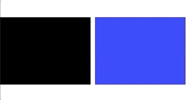
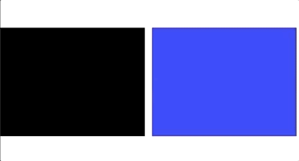
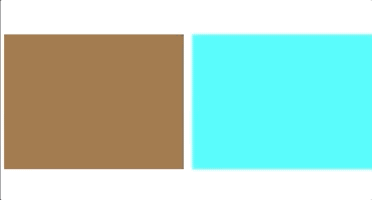

# SnappingLayout

[](https://cocoapods.org/pods/SnappingLayout)
[](https://cocoapods.org/pods/SnappingLayout)
[](https://cocoapods.org/pods/SnappingLayout)
[](https://github.com/apple/swift)
[](https://github.com/Carthage/Carthage)
[![swift-package-manager](https://img.shields.io/badge/package%20manager-compatible-brightgreen.svg?logo=data:image/svg+xml;base64,PD94bWwgdmVyc2lvbj0iMS4wIiBlbmNvZGluZz0iVVRGLTgiPz4KPHN2ZyB3aWR0aD0iNjJweCIgaGVpZ2h0PSI0OXB4IiB2aWV3Qm94PSIwIDAgNjIgNDkiIHZlcnNpb249IjEuMSIgeG1sbnM9Imh0dHA6Ly93d3cudzMub3JnLzIwMDAvc3ZnIiB4bWxuczp4bGluaz0iaHR0cDovL3d3dy53My5vcmcvMTk5OS94bGluayI+CiAgICA8IS0tIEdlbmVyYXRvcjogU2tldGNoIDYzLjEgKDkyNDUyKSAtIGh0dHBzOi8vc2tldGNoLmNvbSAtLT4KICAgIDx0aXRsZT5Hcm91cDwvdGl0bGU+CiAgICA8ZGVzYz5DcmVhdGVkIHdpdGggU2tldGNoLjwvZGVzYz4KICAgIDxnIGlkPSJQYWdlLTEiIHN0cm9rZT0ibm9uZSIgc3Ryb2tlLXdpZHRoPSIxIiBmaWxsPSJub25lIiBmaWxsLXJ1bGU9ImV2ZW5vZGQiPgogICAgICAgIDxnIGlkPSJHcm91cCIgZmlsbC1ydWxlPSJub256ZXJvIj4KICAgICAgICAgICAgPHBvbHlnb24gaWQ9IlBhdGgiIGZpbGw9IiNEQkI1NTEiIHBvaW50cz0iNTEuMzEwMzQ0OCAwIDEwLjY4OTY1NTIgMCAwIDEzLjUxNzI0MTQgMCA0OSA2MiA0OSA2MiAxMy41MTcyNDE0Ij48L3BvbHlnb24+CiAgICAgICAgICAgIDxwb2x5Z29uIGlkPSJQYXRoIiBmaWxsPSIjRjdFM0FGIiBwb2ludHM9IjI3IDI1IDMxIDI1IDM1IDI1IDM3IDI1IDM3IDE0IDI1IDE0IDI1IDI1Ij48L3BvbHlnb24+CiAgICAgICAgICAgIDxwb2x5Z29uIGlkPSJQYXRoIiBmaWxsPSIjRUZDNzVFIiBwb2ludHM9IjEwLjY4OTY1NTIgMCAwIDE0IDYyIDE0IDUxLjMxMDM0NDggMCI+PC9wb2x5Z29uPgogICAgICAgICAgICA8cG9seWdvbiBpZD0iUmVjdGFuZ2xlIiBmaWxsPSIjRjdFM0FGIiBwb2ludHM9IjI3IDAgMzUgMCAzNyAxNCAyNSAxNCI+PC9wb2x5Z29uPgogICAgICAgIDwvZz4KICAgIDwvZz4KPC9zdmc+)](https://github.com/apple/swift-package-manager)


## :earth_americas: Description

**SnappingLayout** enables a snap behaviour for `UICollectionViews`.
It works with horizontal scrolling and there are 3 different types: left, center and right.
You can scroll your collection view and it will automatically snap to the chosen position after decelerating.

The snap supports all kinds of collection view configurations: with `sectionInset`, `minimumLineSpacing`, `contentInset` and so forth.

## :coffee: Contents
- [:traffic_light: Requirements](#-requirements)
- [:computer: Installation](#-installation)
- [:mortar_board: Example Project](#-example-project)
- [:snowboarder: Usage](#-usage)
- [:man_technologist: Authors](#-authors)
- [:speech_balloon: Contributing](#-contributing)
- [:cop: License](#-license)

## 🚥 Requirements

- iOS 9.0+
- Swift 4.2+

## 💻 Installation

### CocoaPods
[CocoaPods](https://cocoapods.org) is a dependency manager for Cocoa projects. You can install it with the following command:
```
$ gem install cocoapods
```

To integrate **SnappingLayout** into your Xcode project using **CocoaPods**, specify it in your Podfile:
```ruby
pod 'SnappingLayout'
```

Then, run the following command:
```
$ pod install
```

### Carthage
> only available from version `0.1.2` onwards

[Carthage](https://github.com/Carthage/Carthage) is a decentralized dependency manager that builds your dependencies and provides you with binary frameworks.

You can install **Carthage** with [Homebrew](https://brew.sh/) using the following command:
```
$ brew update
$ brew install carthage
```

To integrate **SnappingLayout** into your Xcode project using **Carthage**, specify it in your Cartfile:
```
github "SnappingLayout" ~> 0.1.2
```

Run carthage update to build the framework and drag the built SnappingLayout.framework into your Xcode project.

### Swift Package Manager
> only available from version `0.1.4` onwards

[Swift Package Manager](https://swift.org/package-manager/) is a tool for managing the distribution of Swift code. It’s integrated with the Swift build system to automate the process of downloading, compiling, and linking dependencies.

To integrate **SnappingLayout** into your Xcode project using **Swift Package Manager**, add it to the dependencies value of your Package.swift:
```yaml
dependencies: [
    .package(url: "https://github.com/getmimo/SnappingLayout.git", .upToNextMajor(from: "0.1.4"))
]
```

### Manually
If you prefer not to use either of the aforementioned dependency managers, you can always rely on the good old way of integrating **SnappingLayout** into your project manually.

## 🎓 Example Project

To run the example project, clone the repo, and run pod install from the Example directory first. 
Open **SnappingPresentationViewController** to see the code needed to implement the snapping.

## 🏂 Usage

Just use **SnappingLayout** as a replacement for the traditional **UICollectionViewFlowLayout**.

It's as simple as:
1. Importing it:
```swift
import SnappingLayout
```
2. Instantiating it:
```swift
let snappingLayout = SnappingLayout()
```
3. And using it:
```swift
let collectionView = UICollectionView(frame: .zero, collectionViewLayout: snappingLayout)
```
4. Set the deceleration rate of the collection view to fast:
```swift
collectionView.decelerationRate = .fast
```

There are three types of `snappingLayout`: left, center and right.

### Left

This is the **default value** when a new instance of `snappingLayout` is created and it will snap the position of the cell to the left side of the collection view.

```swift
let snappingLayout = SnappingLayout()
snappingLayout.snapPosition = .left
```



### Center

This will snap the position of the cell to the center of the collection view.

```swift
let snappingLayout = SnappingLayout()
snappingLayout.snapPosition = .center
```



### Right

This will snap the position of the cell to the right of the collection view.

```swift
let snappingLayout = SnappingLayout()
snappingLayout.snapPosition = .right
```



### Vertical scrolling

With vertical scrolling enabled, `.top`, `.center`, and `.bottom` can snap the cell to their respective parts of the collection view.

```swift
let snappingLayout = SnappingLayout()
snappingLayout.snapPosition = .top
```


## 💬 Contributing
This is an open source project, so feel free to contribute. How?

- Open an [issue](https://github.com/getmimo/SnappingLayout/issues/new);
- Send feedback via [email](mailto://kvdesa@gmail.com);
- Propose your own fixes, suggestions and open a pull request with the changes.

See [all contributors](https://github.com/getmimo/SnappingLayout/graphs/contributors).


## 👨‍💻 Authors

- [Kévin Cardoso de Sá](https://twitter.com/kvdesa)

## 👮 License

**SnappingLayout** is available under the MIT license. See the LICENSE file for more info.
